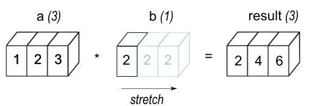

# TIL Template

## 날짜: 2025-02-05

### 스크럼
- 학습 목표 1 : NumPy 심화학습 정리하기
- 학습 목표 2 : Pandas 내용 마저 정리하기
- 학습 목표 3 : NumPy 미니 퀘스트 완료하기

### 새로 배운 내용
#### 주제 1: NumPy 심화학습
- 라이브러리를 처음 배울 땐, 공식 홈페이지에서 Guide를 참고하는 것이 좋다. NumPy를 잘 하고 싶으면 만든 사람의 해설을 먼저 보는 것이 좋다.

- 현재 Python은 ML/DL 계열에서 표준 언어가 되고 있다. Python은 양자 컴퓨팅까지 지원하기 때문에 미래에는 양자 컴퓨팅의 표준 언어가 될 가능성이 있다.

- NumPy는 `ndarray`가 주요 핵심이다. Python에서는 동적 메모리를 사용하기 때문에 배열을 사용할 때, C에 비해서 속도가 굉장히 느리다. 따라서 `ndarray`로 C 배열처럼 만들어 기존 Python에 비해 굉장히 빠르고 C의 속도와 비슷하다. 배열이면 loop을 명시적으로 돌아야 하는데, Vectorization을 이용해 loop을 없앴다. 하드웨어 자체가 Vectorization을 지원하므로 NumPy는 이에 대해 최적화가 되어 가능하다.

- `ndarray`를 생성하는 방법은 [6가지 일반적인 메커니즘](https://numpy.org/doc/stable/user/basics.creation.html)이 존재한다.</br>
어제 배웠던 내용이지만 참고하면 좋다.
  1. Conversion from other Python structures (i.e. lists and tuples)
  2. Intrinsic NumPy array creation functions (e.g. arange, ones, zeros, etc.)
  3. Replicating, joining, or mutating existing arrays
  4. Reading arrays from disk, either from standard or custom formats
  5. Creating arrays from raw bytes through the use of strings or buffers
  6. Use of special library functions (e.g., random)

- `ndarray`의 기본 [indexing 방법](https://numpy.org/doc/stable/user/basics.indexing.html)은 Python은 `x[obj]` 문법을 사용한다.
  1. Basic indexing - 해당 내용은 어제 배웠던 내용이다.</br>
  - All arrays generated by basic slicing are always views of the original array. NumPy slicing creates a view instead of a copy as in the case of built-in Python sequences such as string, tuple and list.
  2. Advanced indexing
  3. Field access

- Copies and Views
  1. It is possible to access the array differently by just changing certain metadata like stride and dtype without changing the data buffer. The data buffer remains the same, so any changes made to a view reflects in the original copy. `ndarray.view` method

  2. When a new array is created by duplicating the data buffer as well as the metadata, it is called a copy. Making a copy is slower and memory-consuming but sometimes necessary. A copy can be forced by using `ndarray.copy`
- Python & NumPy 비교
  ```python
  a = [1, 2, 3]
  b = a

  print(f"b = {b}")

  b[0] = 2
  print(f"b = {b}")
  print(f"a = {a}")
  ```
  출력
  ```
  b = [1, 2, 3]
  b = [2, 2, 3]
  a = [2, 2, 3]
  ```
  ---
  ```python
  a = [1, 2, 3]
  b = a[:] 
  #b = a.copy()

  print(f"b = {b}")

  b[0] = 2
  print(f"b = {b}")
  print(f"a = {a}")
  ```
  출력
  ```
  b = [1, 2, 3]
  b = [2, 2, 3]
  a = [1, 2, 3]
  ```
  ---
  ```python
  import numpy as np

  x = np.arange(10) # x = [0 1 2 3 4 5 6 7 8 9]
  y = x[1:3] # creates a view
  x[1:3] = [10, 11]
  print(y)
  ```
  출력
  ```
  [10 11]
  ```
  NumPy의 Slicing은 Python의 shallow copy와 비슷하다. 즉, Python과 NumPy의 Copy 작동 방식이 다르다는 것을 명심해야한다.</br>
  
- Advanced indexing
  ```python
  import numpy as np
  x = np.arange(9).reshape(3, 3)

  # x = [[0 1 2]
  #      [3 4 5]
  #      [6 7 8]]

  y = x[[1, 2]] # [x[1], x[2]]
  # y = [[3 4 5]
  #      [6 7 8]]
  x[[1, 2]] = [[10, 11, 12], [13, 14, 15]]
  print(y)
  ```
  출력
  ```
  [[3 4 5]
   [6 7 8]]
  ```
  해당 내용은 view가 아닌 copy임을 알 수 있다.

- Broadcasting
  ```python
  import numpy as np

  a = np.array([1.0, 2.0, 3.0])
  b = 2
  print(a * b)
  ```
  출력
  ```
  [2. 4. 6.]
  ```
  </br>
  [General broadcasting rules](https://numpy.org/doc/stable/user/basics.broadcasting.html)</br>
  When operating on two arrays, NumPy compares their shapes element-wise. It starts with the trailing (i.e. rightmost) dimension and works its way left. Two dimensions are compatible when
  1. they are equal, or
  2. one of them is 1.</br>

  stretch는 복제하지만 실제 메모리는 사용하지 않는다. 동작의 layer로써 내부 구현은 복제가 아닌 효율적 방식의 낮은 layer 사용.

- lambda 함수
  lambda 함수란 일회성으로 사용되는 한줄 짜리 간단한 함수를 의미한다. 일반적으로 이름이 없는 간단한 함수를 빠르게 정의할 때 사용되며 코드가 짧고 간결해지는 특징이 있다.</br>
  기본 문법은 `lambda 매개변수1, 매개변수2, ... : 표현식` 이다.

### 오늘의 도전 과제와 해결 방법
- 도전 과제 1: NumPy 심화과정을 이해하면서 NumPy 미니 퀘스트 완료해보기

### 오늘의 회고
- 공식 문서를 통해 라이브러리를 학습하는 방법을 배웠다. 현재 github, tistory 등 개인들이 만든 포트폴리오 자료를 참고하여 배울 수 있지만 가장 깊게 배울 수 있는 곳이 개발자가 직접 만든 `README`라는 것에 공감한다.</br>
공식 페이지는 어렵다는 생각이 있었는데, 오늘 Alex와 함께 같이 읽어보니 어렵지 않고 좋은 예시와 세세하게 잘 표현해준다는 것을 알 수 있어서 다른 모르는 것이 있을 때는 공식 페이지를 참조해보는 것이 많은 도움이 될 것이라는 생각이 들었다.

### 참고 자료 및 링크
- [NumPy 공식 홈페이지](https://numpy.org/)
- [KTB 교육자료]() *비공개*
