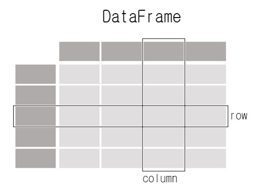
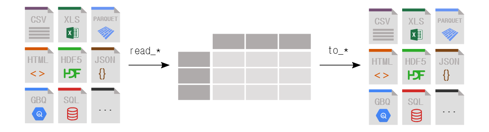
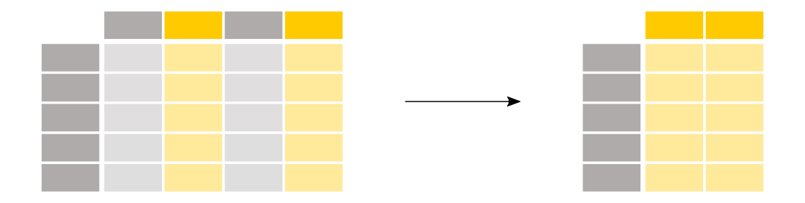
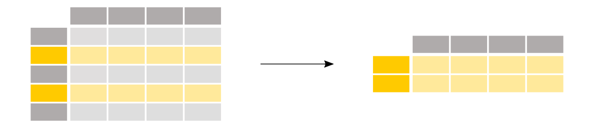
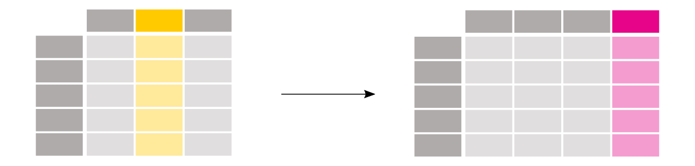
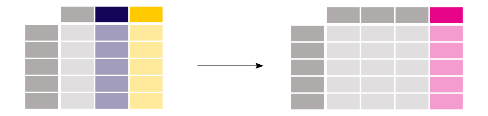
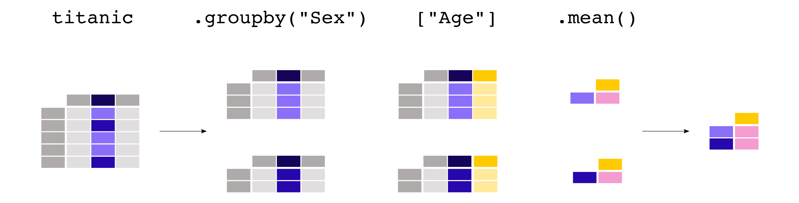

# TIL Template

## 날짜: 2025-02-06

### 스크럼
- 학습 목표 1 : Pandas 심화학습 정리하기
- 학습 목표 2 : Pandas 미니 퀘스트 완료하기
- 학습 목표 3 : 2주차 메인 과제 완료하기
- 학습 목표 4 : SQLD 공부하기

### 새로 배운 내용
#### 주제 1: Pandas 심화학습
- Pandas : **데이터 분석**(읽기)과 **조작**(쓰기)을 하는데 특화되어 있다고 설명한다.
- Pandas는 `DataFrame`과 `Series`를 다루는 것이 핵심이다.

Each column in a `DataFrame` is a `Series`</br>
`DataFrame` : Matrix,   `Series` : Column Vector</br>
When selecting a single column of a pandas `DataFrame`, the result is a pandas `Series`. To select the column, use the column label in between square brackets `[]`.
   ```python
   import pandas as pd

   df = pd.DataFrame(
     {
         "Name": [
             "Braund, Mr. Owen Harris",
             "Allen, Mr. William Henry",
             "Bonnell, Miss. Elizabeth",
         ],
         "Age": [22, 35, 58],
         "Sex": ["male", "male", "female"],
     })
     
     print(df['Age'])
   ```
   출력
   ```   
   Age
   0	22
   1	35
   2	58
   ```
- pandas는 다양한 포멧이나 다양한 데이터 소스를 읽고 쓸 수 있다.

`read_*`fuctions을 이용해서 읽어오고 `to_*`functions을 이용해 내보낼 수 있다.

- pandas는 다양한 형태로 `DataFrame`을 추출할 수 있다.

To select a single column, use square brackets `[]` with the column name of the column of interest.
To select multiple columns, use a list of column names within the selection brackets `[]`.

To select rows based on a conditional expression, use a condition inside the selection brackets `[]`. e.g. `titanic["Age"] > 35`

When using `loc`/`iloc`, the part before the comma is the rows you want, and the part after the comma is the columns you want to select.</br>
Select specific rows and/or columns using `loc` when using the row and column names.</br>
Select specific rows and/or columns using `iloc` when using the positions in the table.
- pandas는 여러 columns들을 계산하여 새로운 columns을 만들 수 있다.


Create a new column by assigning the output to the DataFrame with a new column name in between the `[]`.</br>
Operations are element-wise, no need to loop over rows.</br>
Use `rename` with a dictionary or function to rename row labels or column names.

`groupby` provides the power of the split-apply-combine pattern.

- Categorical Data
`Categoricals` are a pandas data type corresponding to categorical variables in statistics. A categorical variable takes on a limited, and usually fixed, number of possible values (`categories`; `levels` in R)</br>
Categorical `Series` or columns in a `DataFrame` can be created in several ways:</br>
By specifying `dtype="category"` when constructing a `Series`:</br>
  ```python
  import pandas as pd

  s = pd.Series(["a", "b", "c", "a"], dtype="category")
  print(s)
  ```
  출력
  ```
  0    a
  1    b
  2    c
  3    a
  dtype: category
  Categories (3, object): ['a', 'b', 'c']
  ```
  By using special functions, such as `cut()`, which groups data into discrete bins. See the example on tiling in the docs.
  ```python
  import pandas as pd
  import numpy as np

  df = pd.DataFrame({"value": np.random.randint(0, 100, 20)})
  labels = ["{0} - {1}".format(i, i + 9) for i in range(0, 100, 10)] # list comprehension
  df["group"] = pd.cut(df.value, range(0, 105, 10), right=False, labels=labels)

  df.head(10)
  ```
  출력
  ```
  	value	group
   0	41	40 - 49
   1	38	30 - 39
   2	67	60 - 69
   3	60	60 - 69
   4	15	10 - 19
   5	5	0 - 9
   6	92	90 - 99
   7	75	70 - 79
   8	66	60 - 69
   9	62	60 - 69
  ```

- [pandas API](https://pandas.pydata.org/docs/reference/frame.html)
  
  일반적인 라이브러리는 API를 통해 함수에 대한 설명 등이 포함되어 있다. API문서를 통해 코드까지 확인할 수 있다. 함수의 parameter를 설명하는 것은 [Keyword Argument](https://www.w3schools.com/python/gloss_python_function_keyword_arguments.asp)라고 하며 사용법은 링크에 자세히 설명되어 있다.</br>

  만약에 메서드를 사용하다가 문제가 생기거나 어떻게 동작하는지에 대해 궁금하면 해당 라이브러리의 API reference를 참고하는 것이 좋다.

  OpenSource의 장점은 fork를 통해 코드를 직접 수정해보면서 자신만의 Version을 생성할 수 있다. 공부에 아주 도움된다.

#### 주제 2: SQLD 데이터 모델링의 이해
- DBMS(DataBaseManagementSystem) : 데이터 베이스를 관리하는 시스템
  |용어|설명|
  |--|--|
  |`엔터티(Entity)` $\leftrightarrow$ `테이블(Table)`|현실 세계에서 독립적으로 식별 가능한 객체나 사물을 나타냄|
  |`속성(Attribute)` $\leftrightarrow$ `컬럼(Column)`|업무에서 필요로 하는 고유한 성질, 특징을 의미하며 컬럼으로 표현할 수 있는 단위|
  |`인스턴스(Instance)` $\leftrightarrow$ `행(Row)`|특정 데이터|

## 모델링의 개념
  - 현실 세계의 비즈니스 프로세스와 데이터 요구 사항을 추상적이고 구조화된 형태로 표현하는 과정
  - 데이터베이스의 구조와 관계를 정의하며, 이를 통해 데이터의 저장, 조작, 관리 방법을 명확하게 정의

## 모델링의 특징
  1. 단순화(Simplification)
     - 현실을 단순화하여 핵심 요소에 집중하고 `불필요한 세부 사항을 제거`
     - 단순화를 통해 복잡한 현실 세계를 이해하고 표현하기 쉬워짐

  2. 추상화(Abstraction)
     - 현실세계를 일정한 형식에 맞추어 `간략하게` 대략적으로 표현하는 과정
     - 다양한 현상을 일정한 양식인 표기법에 따라 표현

  3. 명확화(Clarity)
     - 대상에 대한 애매모호함을 최대한 제거하고 `정확하게 현상을 기술`하는 과정
     - 명확화를 통해 모델을 이해하는 이들의 의사소통을 원활이 함

## 데이터 모델링 3가지 관점
  1. 데이터 관점
     - 데이터가 어떻게 저장되고, 접근되고, 관리되는지를 정의하는 단계

  2. 프로세스 관점
     - 시스템이 어떤 작업을 수행하며, 이러한 작업들이 어떻게 조직되고 조정되는지를 정의하는 단계
     - 데이터가 시스템 내에서 `어떻게 흐르고 변환되는지에 대한 확인`

  3. 데이터와 프로세스 관점
     - 데이터 관점과 프로세스 관점을 결합하여 시스템의 전반적인 동작을 이해하는 단계
     - 특정 프로세스가 `어떤 데이터를 사용하는지, 데이터가 어떻게 생성되고 변경되는지를 명확하게 정의`
  
## 데이터 모델링 유의점
  1. 중복(Duplication)
     - 한 테이블 또는 여러 테이블에 같은 정보를 저장하지 않도록 설계

  2. 비유연성(Inflexibility)
     - 사소한 업무 변화에 대해서도 잦은 모델 변경이 되지 않도록 주의</br>
       ex) 행이 추가가 되는 것은 괜찮으나 Column이 추가되는 것은 좋지 않은 모델링
     - 데이터 정의를 프로세스와 분리

  3. 비일관성(Inconsistency)
     - 데이터베이스 내의 정보가 모순되거나 상반된 내용을 갖는 상태를 의미
     - 데이터간 상호연관 관계를 명확히 정의
     - 데이터 품질 관리 필요
     - 데이터의 중복이 없더라도 비일관성은 발생할 수 있음

- 데이터 모델링의 3가지 요소
  1. 대상(Entity) : 업무가 관리하고자 하는 대상(객체)

  2. 속성(Attribute) : 대상들이 갖는 속성(하나의 특징으로 정의될 수 있는 것)

  3. 관계(Relationship) : 대상들 간의 관계(Entity와 Entity의 연결고리)

## 데이터 모델링의 3단계
  1. 개념적 모델링
     - 업무 중심적이고 포괄적(전사적)인 수준의 모델링
     - `추상화 수준이 가장 높음`
     - 업무를 분석 뒤 업무의 핵심 엔터티(Entity)를 추출하는 단계
     - 도출된 핵심 엔터티(Entity)들과의 관계들을 표현하기 위해 ERD 작성

  2. 논리적 모델링
     - 개념적 모델링의 결과를 토대로 `세부속성`, `식별자`, `관계` 등을 표현하는 단계
     - 데이터 구조를 정의하기 때문에 비슷한 업무나 프로젝트에서 동일한 형태의 데이터 사용 시 재사용 가능
     - 동일한 논리적 모델을 사용하는 경우 쿼리도 재사용 가능
     - 데이터 정규화 수행
     - 재사용성이 높은 논리적 모데은 유지보수가 용이해짐

  3. 물리적 모델링
     - 논리 모델링이 끝나면 이를 직접 `물리적으로 생성하는 과정`
     - 데이터베이스 성능, 디스크 저장구조, 하드웨어의 보안성, 가용성 등을 고려
     - 가장 구체적인 데이터 모델링
     - 추상화 수준은 가장 낮음(가장 구체적인 모델링이므로)
  
      개념적 모델링 $\rightarrow$ 논리적 모델링 $\rightarrow$ 물리적 모델링 순으로 구체화 된다.

## 스키마의 3단계 구조
  - `스키마` : 데이터베이스의 구조와 제약 조건에 관한 전반적인 명세를 기술한 메타데이터의 집합
  - 사용자의 관점과 실제 설계된 물리적인 방식을 분리하기 위해 고안됨
  - 외부, 개념, 내부 스키마로 분리

  1. 외부 스키마
     - 사용자가 보는 관점에서 데이터베이스 스키마를 정의
     - 사용자나 응용프로그램이 필요한 데이터를 정의(View : 사용자가 접근하는 대상)

  2. 개념 스키마 (논리적 모델링 단계를 거쳐 만들어진 스키마)
     - 사용자 관점의 데이터베이스 스키마를 통합하여 데이터베이스의 전체 논리적 구조를 정의
     - 전체 데이터베이스의 개체, 속성, 관계, 데이터 타입 등을 정의

  3. 내부 스키마 (물리적 모델링 단계를 거쳐 만들어진 스키마)
     - 데이터가 `물리적으로 어떻게 저장되는지를 정의`
     - 데이터의 저장 구조, 컬럼, 인덱스 등을 정의함

- 3단계 스키마의 독립성
  - 독립성 : 물리적, 논리적 구조를 변경하더라도 사용자가 사용하는 응용 프로그램에 영향을 주지 않는 특성
  1. 논리적 독립성 : 논리적 데이터 구조가 변경되어도(개념 스키마 변경) 응용 프로그램에 영향을 주지 않는 특성

  2. 물리적 독립성 : 물리적 구조가 변경되어도(내부 스키마 변경) 개념/외부 스키마에 영향을 주지 않는 특성

## 데이터 모델의 표기법(ERD: Entity Relationship Diagram)
  - 엔터티(Entity)와 엔터티 간의 관계(Relationship)를 시각적으로 표현한 다이어그램
  - 1976년 피터 첸(Peter Chen)이 만든 표기법, 데이터 모델링 표준으로 사용

## ERD 작성 절차(6단계)
  1. 엔터티를 도출한 후 그린다.
  2. 엔터티 배치
  3. 엔터티 간의 관계를 설정
  4. 관계명을 서술
  5. 관계의 참여도 기술
  6. 관계의 필수 여부를 확인

### 오늘의 도전 과제와 해결 방법
- 도전 과제 1: Pandas 심화과정을 이해하면서 Pandas 미니 퀘스트 완료하기
- 도전 과제 2: SQLD 처음 시작

### 오늘의 회고
- Categorical Data에 대해 배웠는데, AI에서 가장 중요하다고 생각되는 부분 중 하나이다. Pandas에서 어떤 원리로 다루어지는지는 생각해보지 않고 그냥 사용했었는데, 오늘 그 원리를 배우며 앞으로 응용하여 사용해보도록 해야겠다.

- 1주차 과제에 비해 2주차 과제가 그렇게 어렵게 느껴지지 않았다. NumPy와 Pandas는 학교에서 많이 사용해 본 경험이 있고 심지어 과제에 나오는 `DataFrame`에 비해 광범위한 데이터를 많이 다루어 보았기 때문이다.

- SQLD 데이터 모델링의 이해부분을 학습하였다. 이 부분은 SQL 뿐만 아니라 AI에서도 중요한 부분이며 겹치는 부분이 많다는 걸 알았다. 좀 더 심화된 학습과 복습이 되는 듯 싶다.

### 참고 자료 및 링크
- [pandas 공식 홈페이지](https://pandas.pydata.org/docs/index.html#)
- [KTB 교육자료]() *비공개*
- [홍쌤의 데이터랩](https://www.youtube.com/@hdatalab)
