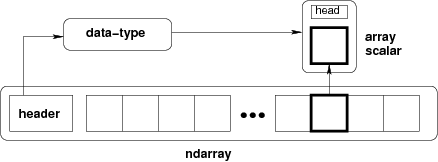

# TIL Template

## 날짜: 2025-02-07

### 스크럼
- 학습 목표 1 : 딥 다이브 내용 정리
- 학습 목표 2 : SQLD 학습

### 새로 배운 내용
#### 주제 1: 2주차 딥 다이브
- NumPy 배열의 생성과 연산이 데이터를 어떻게 처리하는지 설명하시오.</br>

  *NumPy 배열은 동일한 데이터 타입을 가진 배열로 연속된 메모리 블록에 저장하여 벡터화 연산 등의 작업으로 데이터를 메모리 효율적으로 처리한다.*
  1. 배열의 생성 **The N-dimensional array**(`ndarray`)</br>
     </br>
     NumPy의 배열인 `ndarray`는 **동일한 데이터 타입**을 가진 배열로 데이터를 효율적으로 저장하고 연산하기 위한 기본 자료구조이다. 동일한 `dtype`을 가지기 때문에 각 블록마다 크기를 고정시킬 수 있다. 따라서 메모리 블록을 연속적으로 만들 수 있어 효율적으로 저장하고 연산하는 것이 가능해진다.
     ```python
     ndarray = np.array([1, 2, 3], dtype = np.int32)
     ```
     해당 `ndarray`의 경우 각 4bytes 씩 메모리에 연속적으로 배치된다. 따라서 값들을 참조하기 쉽다.</br>
     반면, 일반적인 Python의 `list`는 내부적으로는 실제 데이터가 저장된 객체를 가리키는 포인터이다.
     ```python
     pylist = [1, "String", 'A', 3.14, [1, 2, 3]]
     ```
     해당 `list`는 동적으로 크기가 늘어나도록 설계되어 있으며 순수 값만 저장되는 `ndarray`와 달리 각 객체에 대한 헤더와 참조 카운트 등이 필요로 하다.</br>
     같은 힙 메모리지만 바로 옆에 붙어있는 것과 포인터만 있는 것은 다르다.</br>


     단, 메모리 블록을 연속적으로 만들기 때문에 동적 메모리인 `list`처럼 요소를 추가하거나 삭제할 수 없다. `np.append()`, `np.delete()`는 `view`타입이다.
     ```python
     import numpy as np

     pylist = [1, 2, 3]
     pylist.append(4)

     print(pylist, '\n')

     ndarray = np.array([1, 2, 3], dtype = np.int32)
     np.append(ndarray, 4)

     print(ndarray)
     print(np.append(ndarray, 4))
     ```
     ```
     [1, 2, 3, 4]

     [1 2 3]
     [1 2 3 4]
     ```


     ---

  2. 배열의 연산</br>
     배열에 대한 연산이 필요할 때, `ndarray`의 경우 헤더만 참조하여 같은 `dtype`인지 확인하고 연산할 수 있다. 하지만 일반적인 Python `list`의 경우 동적 타입 검사가 필요하다. 즉, 반복문 작업이 추가적으로 필요하다.
     
     벡터화란 배열의 각 원소에 대해 일괄적으로 연산을 수행하는 방식을 의미한다. 일반적으로 Python에서는 반복문을 사용하여 하나하나 연산하는 반면 NumPy는 C나 Fortran으로 구현된 최적화된 내부 루틴을 사용하여 전체 배열을 한 번에 처리한다.
     ```python
     pylist1 = [1, 2, 3, 4]
     pylist2 = [10, 20, 30, 40]

     print(pylist1 + pylist2)
     ```
     ```
     [1, 2, 3, 4, 10, 20, 30, 40]
     ```
     합을 구현하려면 `for`문과 같은 반복문이 필수적이다.
     ```python
     pylist3 = []
     for i in range(len(pylist1)):
      pylist3.append(pylist1[i] + pylist2[i])

     print(pylist3)
     ```
     ```
     [11, 22, 33, 44]
     ```
     하지만 NumPy는 벡터화를 통해 연산을 수행하기 때문에 바로 계산이 가능하다.
     ```python
     import numpy as np

     array1 = np.array(pylist1)
     array2 = np.array(pylist2)

     print(array1 + array2)
     ```
     ```
     [11 22 33 44]
     ```
     위와 같은 벡터 연산을 지원하는 유니버설 함수(Universal Function)이 존재한다.</br>
     이러한 벡터화의 장점은 전체 배열을 한번에 처리하기 때문에 매우 빠른 연산이 가능하고 복잡한 루프를 작성할 필요가 없어 가독성이 높아진다.</br>
     이런 벡터화 계산 방식이 가능한 이유도 메모리 레이아웃 덕분이다.

     브로드캐스팅을 사용해 서로 다른 모양의 배열 간에도 자동으로 차원을 맞추어 연산할 수 있어 효율적인 수치 계산을 할 수 있다.
     

- 상세 내용 2
- 상세 내용 3

#### 주제 2: 주제에 대한 설명
- 상세 내용 1
- 상세 내용 2

### 오늘의 도전 과제와 해결 방법
- 도전 과제 1: 도전 과제에 대한 설명 및 해결 방법
- 도전 과제 2: 도전 과제에 대한 설명 및 해결 방법

### 오늘의 회고
- 오늘의 학습 경험에 대한 자유로운 생각이나 느낀 점을 기록합니다.
- 성공적인 점, 개선해야 할 점, 새롭게 시도하고 싶은 방법 등을 포함할 수 있습니다.

### 참고 자료 및 링크
- [NumPy - Array creation](https://numpy.org/doc/stable/user/basics.creation.html)
- [링크 제목](URL)